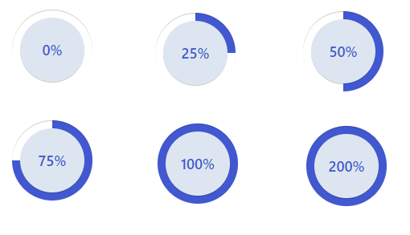
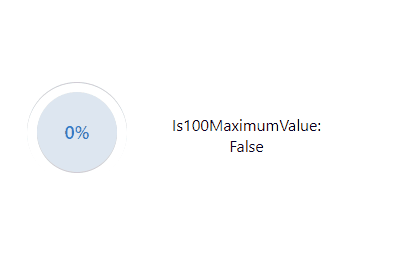
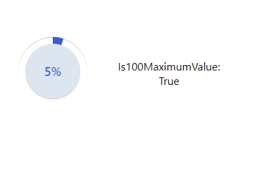

# Progress Control

## Description

This control will allow you to display an integer or a decimal as a % control.

## Download

[DOWNLOAD LATEST RELEASE](https://github.com/victorsolaya/progress-control-pcf/releases/latest)

## How to configure

1. Add the control to the field that will contain the data split by your delimiter.
2. The parameters of the control are explained below

## Parameters

1. Field (required) -> It is the field that will contain the data

2. is100MaximumValue (required) -> Set if 100 is the maximum value for your field number.

3. CSS Path (optional) -> This will allow to you to add your own styles to the component, if it is not set, it will show the ones that have been added by default.
If you want to add your own styles, you need to pass to the parameter the path url of the css component as: /Webresources/vso/css/styles.css

### How to edit the number

If you want to edit the number, just edit it through the number that is displayed inside the control. It will always add a % just for display reasons.
You can edit the common javascript functionality of ...setValue()

### Assets

If you set the maximum value as FALSE

If you set the maximum value as TRUE

### Styles

You can edit the styles if you follow the content as the current .css.